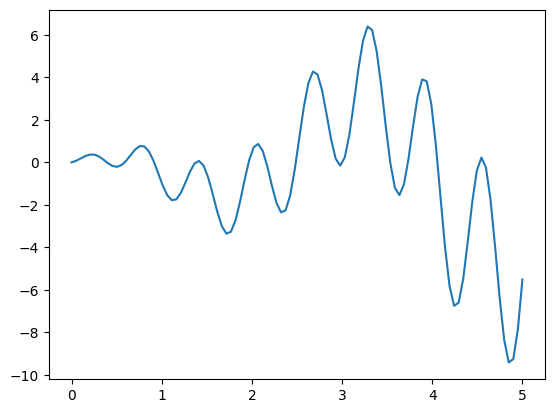
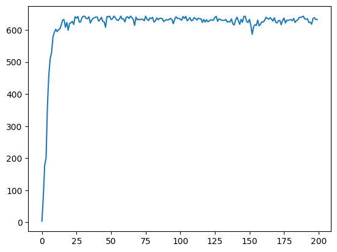
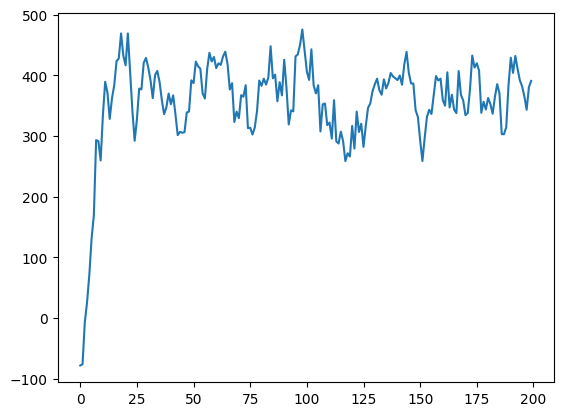

## 113-1 Artificial Intelligence HW2 Report

智能所 312581029 廖永誠

## Questions:

1. HW3.1 Target Function

    

2. HW3.2 Design Fitness Function

    ```python
    def get_fitness(pred: np.ndarray[Tuple[int], np.float32]) -> np.ndarray[Tuple[int], np.float32]: 
        # TODO: Write the Fitness Function and return the fitness value
        """
        Input:
        1. pred: 1D array, size is the number of population, each value represent the predict value of i-th individual.
        Output:
        1. fitness: 1D array, size is the number of population, each value represent the fitness value of i-th individual. 
        """
        return pred + 1e-3 - np.min(pred)
    ```

3. HW3.3 Representation
    
    ```python
    def translateDNA(pop: np.ndarray[Tuple[int, int], np.int64]) -> np.ndarray[Tuple[int], np.float32]:
        # TODO: Write the translateDNA Function and return a 1D array of real values
        """
        Input:
        1. pop: A 2D array where each row represents an individual's DNA, encoded as a binary sequence.
        Output:
        1. scaled_real_number_of_individual: A 1D array of real values, where the binary DNA has been converted to real numbers and scaled according to `X_BOUND[1]`.
        """
        maximum_value = pow(2, DNA_SIZE) - 1
        real_number_vector = np.array([pow(2,i) for i in range(DNA_SIZE-1, -1, -1)], dtype=np.int64)    # [512, 256, ..., 2, 1]
        pop_real_number = np.matmul(pop, real_number_vector)
        normalized_pop_real_number = pop_real_number / maximum_value
        scaled_pop_real_number = normalized_pop_real_number * X_BOUND[1]
        return scaled_pop_real_number
    ```

4. HW3.4 Selection

    ```python
    def select(pop: np.ndarray[Tuple[int, int], np.int64], fitness: np.ndarray[Tuple[int], np.float32]) -> np.ndarray[Tuple[int, int], np.int64]:   # nature selection wrt pop's fitness
        # TODO: Write the select Function and return a 2D array representing the selected population for the next generation
        sum_of_fitness = np.sum(fitness)
        probabilities = fitness / sum_of_fitness
        pop_size = pop.shape[0]
        selected_idx = np.random.choice(np.arange(pop_size), size=pop_size, p=probabilities, replace=True)
        return pop[selected_idx]
    ```

5. HW3.5 Crossover

    ```python
    def crossover(parent: np.ndarray[Tuple[int], np.int64], pop: np.ndarray[Tuple[int, int], np.int64]) -> np.ndarray[Tuple[int], np.int64]:
        # TODO: Write the crossover Function and return a 1D array of parent
        selected_parent_index = np.random.randint(0, pop.shape[0])
        selected_parent = pop[selected_parent_index, :]
        if np.random.rand(1)[0] < CROSS_RATE:
            crossover_point_index = np.random.randint(0, DNA_SIZE)
            parent[crossover_point_index:] = selected_parent[crossover_point_index:]
        return parent
    ```

6. HW3.6 Mutation

    ```python
    def mutate(child: np.ndarray[Tuple[int], np.int64]) -> np.ndarray[Tuple[int], np.int64]:
        # TODO: Write the mutation Function and return the child
        flip_bool = np.random.rand(DNA_SIZE) < MUTATION_RATE
        flip_bool = flip_bool.astype(int)
        child = np.bitwise_xor(child, flip_bool)
        return child
    ```

7. HW3.7 GA Function

    ```python
    def GA(N_GENERATIONS: int, pop: np.ndarray[Tuple[int, int], np.int64]):    
        # TODO: Write the GA Function that evolves a population over many generations to optimize the function F() based on the function you wrote above.
        for _ in range(N_GENERATIONS):
            start = time.time()
            F_values = F(translateDNA(pop))
            performance.append(F_values.sum())
            fitness = get_fitness(F_values)

            pop = select(pop, fitness)
            new_pop = pop.copy()
            for individual_id in range(POP_SIZE):
                parent = new_pop[individual_id,:]
                child = crossover(parent, pop)
                child = mutate(child)
                new_pop[individual_id,:] = child
            pop = new_pop
            
            end = time.time()
            time_per_iteration.append(end - start)
        return performance, time_per_iteration  # Return both performance and time per generation
    ```

8. HW3.8 Performance Visualization
    
    

9. HW3.9 Discuss 1

    - Increase the `MUTATION_RATE` from `0.003` to `0.05`.
    - The performance result is shown below.
        
    - We can observe that the performance is less stable at higher mutation rates. This is because mutation helps ensure that the population has enough diversity to explore the search space. However, if the mutation rate is too high, the population may lose the ability to converge to an optimal solution. Therefore, finding an optimal trade-off when setting the mutation rate is crucial.

10. HW3.10 Discuss 2

    - By correctly using NumPy matrix or vector operations, we can leverage the parallelism of the NumPy library to speed up computations. For example, in the `translateDNA` function, we can use the `np.matmul` function to calculate the real number of the population in parallel. This can enhance performance and make the code more efficient. In my current implementation, one generation only takes an average of `0.00048` seconds.

    - However, the Genetic Algorithm (GA) involves several expensive steps per generation: translating DNA, calculating fitness, selection, crossover, and mutation. The time per generation increases with larger populations and more complex problems. Despite optimizations like NumPy vectorization, GAs are inherently sequential, which limits parallel processing. Additionally, GAs rely on randomness, making convergence times unpredictable. Depending on the complexity and diversity of the problem, they may converge quickly or require many generations.

    - **Comparison with Traditional Heuristic Algorithms**: Traditional heuristics, such as simulated annealing or hill-climbing, are often more efficient for simple problems. These methods iteratively improve a single solution, avoiding the overhead of managing populations. For example, hill-climbing converges quickly in straightforward cases, while GAs perform better on complex, multimodal problems with many local optima, as they maintain solution diversity.

    - **Comparison with Modern Machine Learning Methods**: Modern ML algorithms, such as neural networks and gradient-based optimization methods, often outperform GAs in terms of speed and scalability. ML models leverage parallel processing and efficient backpropagation, particularly with GPUs, resulting in faster training. Since GAs lack gradient information, they rely on evolving populations, which makes them slower for problems well-suited to gradient-based methods like gradient descent.