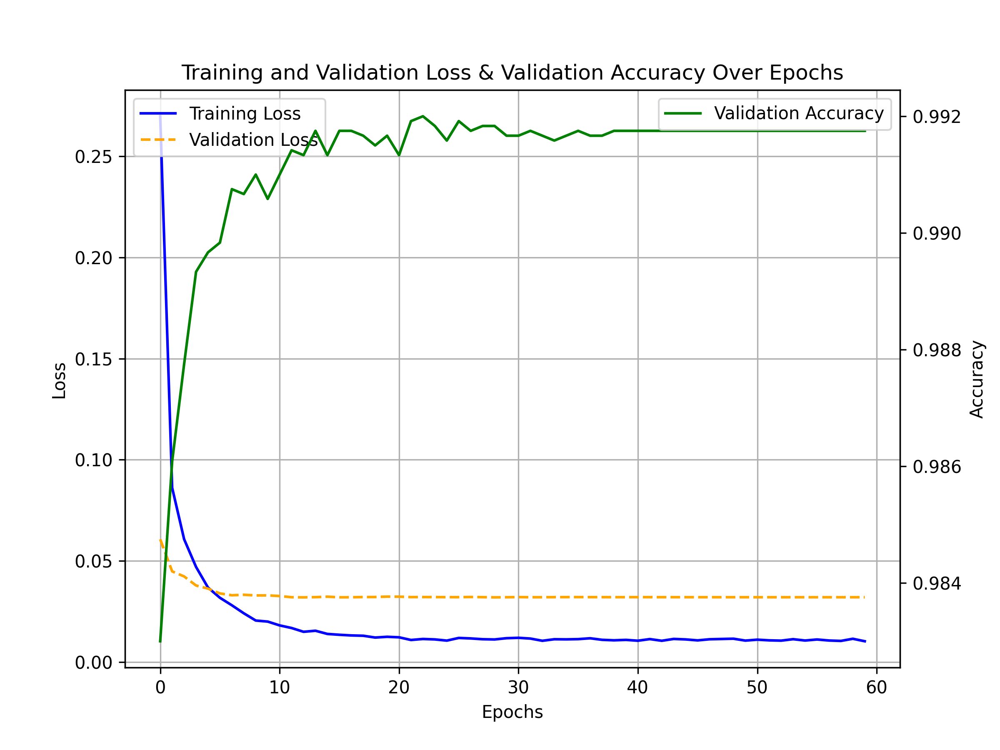

# 113-1 Artificial Intelligence HW3 Report

智能所 312581029 廖永誠

## Implementation and How to Run the Code

1. **Install Dependencies**
    ```bash
    pip install -r requirements.txt
    ```
2. **Setup Configuration**  
   Modify the `run.sh` file as needed.

3. **Select the Model**  
   Update the model in `main.py` (lines 149 and 150):  
    ```python
    model = Net().to(device)
    model = CNN().to(device)
    ```
    - Use `Net` for DNN.
    - Use `CNN` for CNN.  
    - Keep the model you want to use.

4. **Run the Training Task**
    ```bash
    bash run.sh
    ```

## Questions

### HW3.1. Plot the Training & Validation Loss chart, with the X-axis representing Iteration or Epoch and the Y-axis representing Loss. The chart should include two lines: training loss and validation loss.

1. After conducting experiments (hyperparameter tuning, model architecture adjustments, testing CNN architecture), **CNN** demonstrated the best performance.
2. The following configurations were used for the chart:
    - Batch size: 8
    - Train-validation split: 0.8
    - Epochs: 60
    - Learning rate: 0.0005
    - Scheduler gamma: 0.95
3. Validation accuracy is also plotted for better insight into model performance.  
   

### HW3.2: Print the Test Accuracy and Explain Dataset Splitting Strategy

1. Using the highest validation accuracy epoch (with early stopping), the model was evaluated on the test dataset.
    - Test loss: `0.021215508112311363`
    - Test accuracy: `0.9926`
2. **Test Dataset Splitting**: Predefined test datasets don't require splitting, but proper splitting of training and validation datasets is crucial.
3. **Train-Validation Split Strategy**:
    - Too much data in the validation set reduces training data, affecting generalization.
    - Too little data in the validation set reduces its representativeness of the test set.
    - A **train-validation ratio of 8:2** was chosen as a balanced approach.

### HW3.3. Discuss the Impact of Hyperparameter Tuning.-Explain how adjusting different hyperparameters (such as learning rate, batch size, and the number of epochs) affected the performance of your model. Provide examples of specific hyperparameter values you tried and the corresponding changes in training and test accuracy.

- I chose not to tune the number of epochs, setting it large enough to ensure convergence across various configurations (when validation loss ceases to decrease).
- The model configuration was fixed to focus on hyperparameter impact:
  - **DNN**: 1 hidden layer with 256 units.
  - Model code:
    ```python
    class Net(nn.Module):
        def __init__(self):
            super(Net, self).__init__()
            self.flatten = nn.Flatten()
            self.input_layer = nn.Linear(28 * 28, 256)
            self.hidden_layer_0 = nn.Linear(256, 256)
            self.output_layer = nn.Linear(256, 10)

        def forward(self, x):
            x = self.flatten(x)
            x = F.relu(self.input_layer(x))
            x = F.relu(self.hidden_layer_0(x))
            x = self.output_layer(x)
            return x
    ```

#### Tune the Batch Size

- Fixed learning rate (1e-3) and gamma (0.95).
- Adjusted epochs to ensure convergence for each batch size.
- Results:
  ```plaintext
  batch_size | best_valid_loss | best_valid_acc | best_test_loss | best_test_acc
  8          | 0.1749          | 0.9728         | 0.1601         | 0.972
  64         | 0.1734          | 0.9651         | 0.1700         | 0.9637
  256        | 0.1933          | 0.9524         | 0.1893         | 0.9517
  ```

- **Observations**:
  1. Smaller batch sizes introduce more noise in gradient updates, which can serve as regularization and improve test accuracy.
  2. Larger batches harness parallel computing power, speeding up training per epoch.
  3. Choice of batch size depends on the task. For MNIST, smaller batches could prevent overfitting and enhance generalization.

#### Tune the Learning Rate

- Fixed batch size (8) and gamma (0.95).
- Results:
  ```plaintext
  learning_rate | best_valid_loss | best_valid_acc | best_test_loss | best_test_acc
  0.001         | 0.1749          | 0.9728         | 0.1601         | 0.972
  0.0005        | 0.1510          | 0.9718         | 0.1278         | 0.972
  0.0001        | 0.1943          | 0.9614         | 0.1684         | 0.9643
  ```

- **Observations**:
  - Larger learning rates cause faster convergence but risk overshooting.
  - Smaller learning rates converge more slowly and can become trapped in local minima.
  - Optimal learning rate found: 0.0005.

#### Tune the Scheduler Gamma

- Fixed batch size (8) and learning rate (0.0005).
- Results:
  ```plaintext
  gamma | best_valid_loss | best_valid_acc | best_test_loss | best_test_acc
  0.95  | 0.1510          | 0.9718         | 0.1278         | 0.972
  0.9   | 0.1413          | 0.9705         | 0.1276         | 0.9717
  0.85  | 0.1452          | 0.9698         | 0.1316         | 0.9709
  ```

- **Observations**:
  - Larger gamma results in slower rate decay and can hinder convergence.
  - Optimal gamma: 0.95. Smaller values might reduce learning rate too quickly, trapping in local minima.

### HW3.4. Discuss Model Architecture Choices. Reflect on the architecture of your model and the rationale behind choosing the specific number of layers and neurons. What were the trade-offs you considered, and how did your design decisions impact the model's performance and generalization ability?

1. Fixed hyperparameters:
   - Batch size = 8
   - Train-validation split = 0.8
   - Learning rate = 0.0005
   - Scheduler gamma = 0.95

2. Compared three models:
   1. **Original Model**:
      ```python
      class Net(nn.Module):
            def __init__(self):
                super(Net, self).__init__()
                self.flatten = nn.Flatten()
                self.input_layer = nn.Linear(28 * 28, 256)
                self.hidden_layer_0 = nn.Linear(256, 256)
                self.output_layer = nn.Linear(256, 10)

            def forward(self, x):
                x = self.flatten(x)
                x = F.relu(self.input_layer(x))
                x = F.relu(self.hidden_layer_0(x))
                x = self.output_layer(x)
                return x
      ```

   2. **Deeper Model**:
      ```python
      class Net(nn.Module):
            def __init__(self):
                super(Net, self).__init__()
                self.flatten = nn.Flatten()
                self.input_layer = nn.Linear(28 * 28, 256)
                self.hidden_layer_0 = nn.Linear(256, 256)
                self.hidden_layer_1 = nn.Linear(256, 256)
                self.hidden_layer_2 = nn.Linear(256, 256)
                self.output_layer = nn.Linear(256, 10)

            def forward(self, x):
                x = self.flatten(x)
                x = F.relu(self.input_layer(x))
                x = F.relu(self.hidden_layer_0(x))
                x = F.relu(self.hidden_layer_1(x))
                x = F.relu(self.hidden_layer_2(x))
                x = self.output_layer(x)
                return x
      ```

   3. **Wider Model**:
      ```python
      class Net(nn.Module):
            def __init__(self):
                super(Net, self).__init__()
                self.flatten = nn.Flatten()
                self.input_layer = nn.Linear(28 * 28, 1024)
                self.hidden_layer_0 = nn.Linear(1024, 1024)
                self.output_layer = nn.Linear(1024, 10)

            def forward(self, x):
                x = self.flatten(x)
                x = F.relu(self.input_layer(x))
                x = F.relu(self.hidden_layer_0(x))
                x = self.output_layer(x)
                return x
      ```

- Results:
  ```plaintext
  model_type | best_valid_loss | best_valid_acc | best_test_loss | best_test_acc
  original   | 0.1510          | 0.9718         | 0.1278         | 0.972
  deeper     | 0.1177          | 0.9718         | 0.0960         | 0.9731
  wider      | 0.1164          | 0.9766         | 0.1019         | 0.9752
  ```

- **Observations**:
  - Both deeper and wider models improve performance by increasing the number of parameters.

### Bonus: CNN

1. Implemented a CNN inspired by AlexNet, a classic architecture.
2. Model architecture is detailed in `main.py`.
3. For fair comparison with the best DNN, the hyperparameters were fixed:
   - Batch size = 8
   - Train-validation split = 0.8
   - Learning rate = 0.0005
   - Scheduler gamma = 0.95

4. Results:
   ```plaintext
   model_type | best_valid_loss | best_valid_acc | best_test_loss | best_test_acc
   dnn        | 0.1164          | 0.9766         | 0.1019         | 0.9752
   cnn        | 0.0321          | 0.9920         | 0.0212         | 0.9926
   ```

5. **Observations**:
   - CNN outperformed DNN, effectively extracting image features before classification, benefiting from more trainable parameters and feature extraction capabilities.